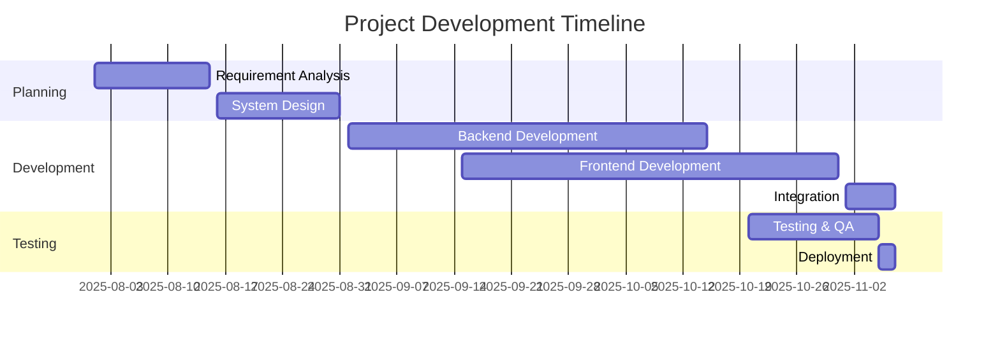
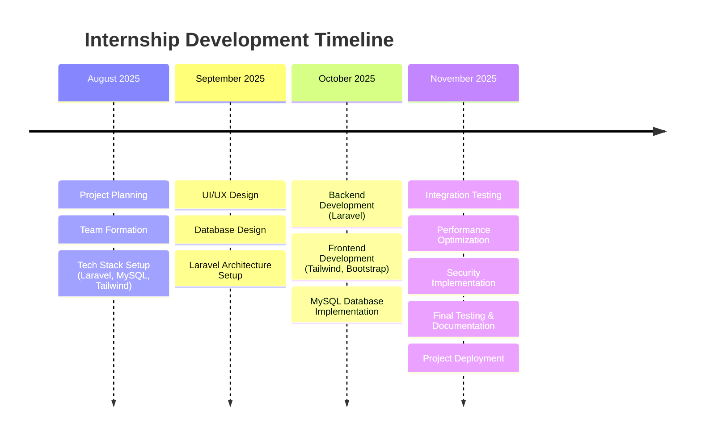

# 🚀 MagangTelkom2025 - Development Team Repository

<div align="center">
  
  
  
  
  

### 🌟 Repository Resmi Tim Magang Developer Infomedia by Telkom Indonesia 2025

  

</div>

---

## 📋 Tentang Repository Ini

Repository ini merupakan **pusat pengembangan project** selama program magang di **Infomedia by Telkom Indonesia 2025**. Semua project, dokumentasi, dan kolaborasi tim developer akan tersimpan dan terorganisir di sini.

<div align="center">
  
  ```mermaid
  graph TB
      A[🏢 Infomedia by Telkom Indonesia] --> B[📚 Magang 2025]
      B --> C[👥 Tim Developer]
      C --> D[🚀 Project Development]
      D --> E[📈 Innovation & Growth]
  ```
  
</div>

---

## 👥 Meet Our Development Team

<div align="center">
  
  | Avatar | Username | Role | Specialization |
  |:------:|:--------:|:----:|:--------------:|
  |  | [**NDP4**](https://github.com/NDP4) | 🔥 Backend Developer | Full Stack Development |
  |  | [**admiral-riz**](https://github.com/admiral-riz) | ⚡ Web Developer | Full Stack Development |
  |  | [**feastco**](https://github.com/feastco) | ⚡ Frontend Expert | Full Stack Development |
  |  | [**faqihhidayatullah**](https://github.com/faqihhidayatullah) | ⚡ Web Developer | Full Stack Development |
  |  | [**CyDreal**](https://github.com/CyDreal) | 🔥 Lead Developer | Full Stack Development |

</div>

---

## 🎯 Tujuan Program Magang

<div align="center">
  
  ```ascii
  ╭─────────────────────────────────────────────────────────╮
  │                    🎯 OBJECTIVES                        │
  ├─────────────────────────────────────────────────────────┤
  │  🚀 Mengembangkan aplikasi innovative untuk Telkom     │
  │  📚 Mempelajari teknologi terdepan industry            │
  │  🤝 Berkolaborasi dalam tim development professional   │
  │  🔧 Mengimplementasikan best practices development     │
  │  📈 Menciptakan solusi yang scalable dan maintainable  │
  ╰─────────────────────────────────────────────────────────╯
  ```
  
</div>

---

## 🛠️ Tech Stack & Tools

<div align="center">

### Programming Languages


### Backend Frameworks


### Frontend Development


### Database


### Development Tools


</div>

---

## 📊 Repository Statistics

<div align="center">
  
  
  
  
  
</div>

---

## 🚀 Upcoming Projects

<div align="center">

### 🔄 Project Planning Phase

Kami sedang dalam tahap **perencanaan dan persiapan** untuk mengembangkan berbagai project inovatif yang akan memberikan nilai tambah bagi Telkom Indonesia. Tim development kami akan fokus pada:

<div align="left" style="max-width: 600px; margin: 0 auto;">

- 🌐 **Web Applications** - Sistem berbasis web untuk internal Telkom
- 🔐 **Security Systems** - Tools monitoring dan keamanan jaringan
- 📊 **Dashboard Analytics** - Platform visualisasi data dan reporting
- � **Corporate Tools** - Aplikasi manajemen dan produktivitas

</div>

### 📅 Timeline Development



_Project details akan diupdate seiring berjalannya program magang_

</div>

---

## 📈 Team Contribution Graph

<div align="center">
  
  ```mermaid
  gitgraph
      commit id: "Project Init"
      branch feature/backend
      checkout feature/backend
      commit id: "Laravel Setup"
      commit id: "Database Migration"
      checkout main
      merge feature/backend
      branch feature/frontend
      checkout feature/frontend
      commit id: "Tailwind Setup"
      commit id: "Bootstrap Components"
      checkout main
      merge feature/frontend
      commit id: "Integration"
      commit id: "Testing"
      commit id: "Deployment"
  ```
  
</div>

---

## 🎯 Development Milestones

<div align="center">

### 🗓️ Timeline Magang 2025



</div>

---

## 🤝 Contributing Guidelines

### 🔄 Workflow Development

1. **Fork** repository ini
2. **Create** branch baru untuk feature (`git checkout -b feature/amazing-feature`)
3. **Commit** perubahan (`git commit -m 'Add amazing feature'`)
4. **Push** ke branch (`git push origin feature/amazing-feature`)
5. **Open** Pull Request dengan template yang disediakan

### 📝 Code Standards

- ✅ Follow **PSR-12** coding standards untuk PHP
- ✅ Gunakan **Laravel Pint** untuk code formatting
- ✅ Tulis **PHPUnit tests** untuk setiap feature baru
- ✅ Dokumentasikan API dengan **Laravel API Documentation**
- ✅ Follow **conventional commits** untuk commit messages
- ✅ Gunakan **Laravel Blade** untuk templating
- ✅ Implementasikan **Eloquent ORM** untuk database operations

---

## 📞 Contact & Support

<div align="center">

### 📧 Get in Touch

[](mailto:magang.telkom2025@gmail.com)
[](#)
[](#)

### 🏢 Infomedia by Telkom Indonesia

**Divisi IT CC Inbound**  
Jl. Japati No. 1, Bandung 40133  
📞 +62-22-520-2020

</div>

---

## 📜 License & Credits

<div align="center">

```
MIT License

Copyright (c) 2025 MagangTelkom2025 Development Team

Permission is hereby granted, free of charge, to any person obtaining a copy
of this software and associated documentation files (the "Software"), to deal
in the Software without restriction, including without limitation the rights
to use, copy, modify, merge, publish, distribute, sublicense, and/or sell
copies of the Software, and to permit persons to whom the Software is
furnished to do so, subject to the following conditions:

The above copyright notice and this permission notice shall be included in all
copies or substantial portions of the Software.
```

---

### 🙏 Acknowledgments

- **Telkom Indonesia** - Untuk kesempatan magang yang luar biasa
- **Mentor Tim** - Untuk guidance dan support selama program
- **Open Source Community** - Untuk tools dan libraries yang amazing

</div>

---

<div align="center">
  
  ### ⭐ Star Repository Ini Jika Bermanfaat!
  
  
  
  ---
  
  **Made with ❤️ by MagangTelkom2025 Team**
  
  
  
  
</div>
